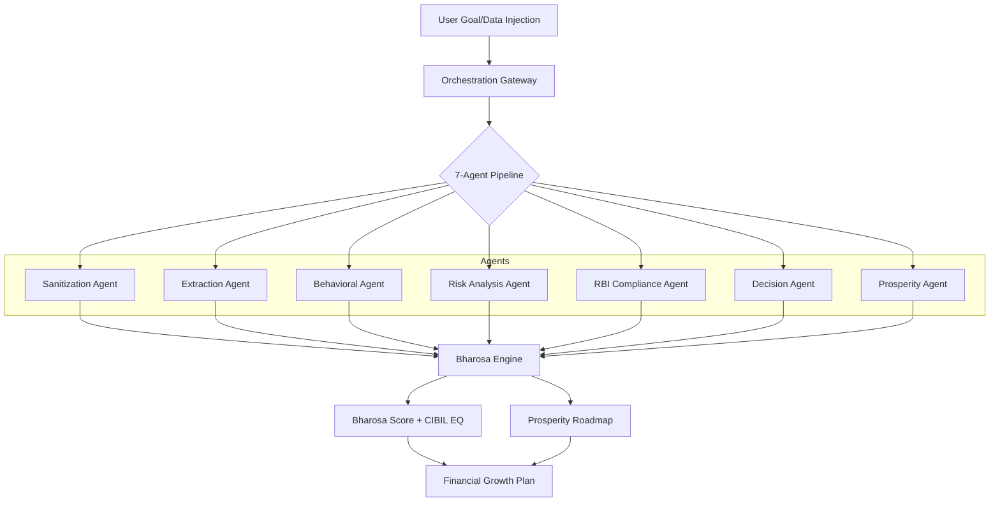

# BharosaCredit: Autonomous Financial Orchestration 🏛️🛡️✨

BharosaCredit is a high-fidelity, multi-agent platform designed to bridge the gap between India's "thin-file" financial demographic—gig workers, rural laborers, and agricultural specialists—and institutional credit. By harvesting behavioral signals and income rhythms rather than relying solely on traditional credit history, we transform raw financial character into a verifiable **Prosperity Roadmap**.

## 🔴 The Problem
Traditional credit scoring models (CIBIL) are fundamentally optimized for salaried employees with predictable cash flows. This leaves over **400M+ Indians** (The Bharat Segment) in a financial blind spot:
- **Income Volatility**: Seasonal agricultural cycles or gig-work rhythms are often flagged as "risky" by static models.
- **Data Fragmentation**: Financial records for this segment are often unstructured, existing in domestic ledgers or UPI transaction histories.
- **Lack of Institutional Trust**: Without a high-fidelity credit score, these individuals are forced into predatory informal lending cycles.

## 🟢 The Solution: Autonomous Multi-Agent Underwriting
BharosaCredit introduces a **7-Agent Autonomous Pipeline** that operates as an intelligent "Control Center" for credit risk and behavioral assessment.



## 🛠️ Tech Stack
- **Frontend**: React (Vite), Tailwind CSS, Framer Motion (Cinematic UI), Recharts (Data Visualization).
- **Backend**: FastAPI (Python), Async Orchestration Engine.
- **Intelligence**: Multi-LLM Orchestration (Groq/Llama-3/Gemma) with adaptive failover.
- **Auth**: Firebase Authentication (Sync Profile Engine).
- **Branding**: Official Indian Bank Logos (22+ partners) integrated via high-availability CDN.

## 📊 Datasets Used
Our simulation and training environment utilizes high-resolution synthetic and real-world behavioral datasets:
- **Bharosa Synthetic Labor Records**: Curated JSON profiles reflecting diverse Indian archetypes (e.g., "Ravi" - Seasonal Agri, "Priya" - Multi-Stream Domestic).
- **Behavioral Flow Signals**: Derived from a "Credit Risk Dataset" (~2000+ records) featuring income volatility and repayment rhythm patterns.
- **Mehnat Scaling Factor**: A proprietary mapping logic that translates "Labor Effort" and "Repayment Discipline" into institutional creditworthiness.

## 🚀 Deployment Guide
### Local Development
1. **Backend**: 
   ```bash
   cd backend
   pip install -r requirements.txt
   uvicorn main:app --reload
   ```
2. **Frontend**:
   ```bash
   cd frontend
   npm install
   npm run dev
   ```

### Vercel Deployment
1. Connect this repository to your **Vercel** account.
2. In the "Project Settings", set the `Root Directory` to `frontend`.
3. Add environment variables if applicable.
4. Deployment for the backend is recommended on services like Railway, Railway, or Google Cloud Run.

---
**BharosaCredit** • *Empowering Bharat's Future, One Verified Profile at a Time.*
